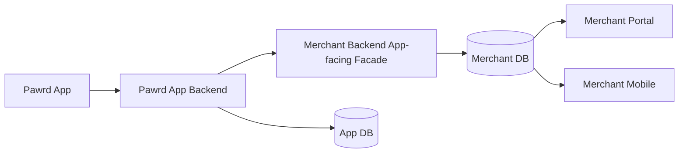
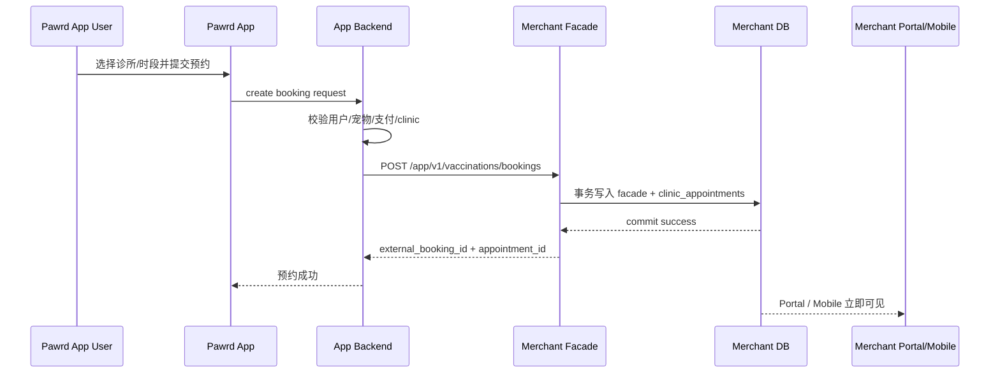
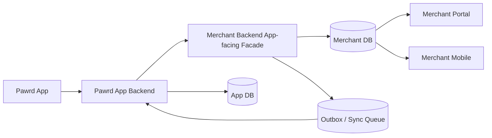
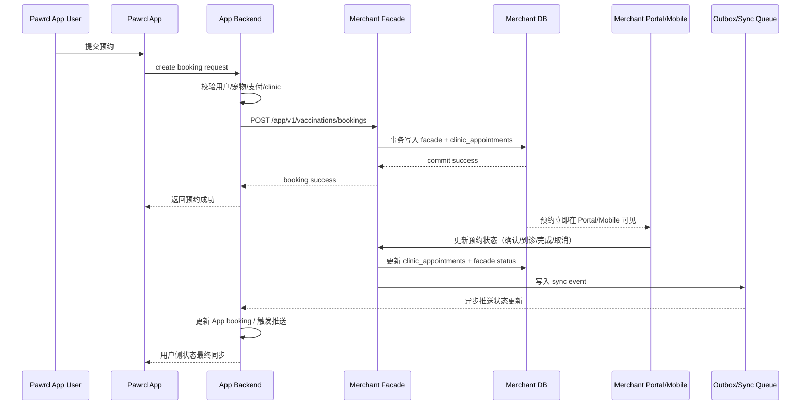

# Pawrd App Backend × Merchant Backend 生产联动架构方案

> 版本：v1.0  
> 日期：2026-04-06  
> 适用范围：Pawrd App、Merchant Portal、Merchant Mobile、Merchant Backend

---

## 0. 文档目标

本文件用于定义 **Pawrd App Backend 与 Merchant Backend 在生产环境中的联动方式**，重点对比以下两种可交付方案：

- **方案 2：同步编排型**
- **方案 4：同步下单 + 异步状态回传型**

本文聚焦以下维度的左右分栏对比：

1. 数据主权
2. API 边界
3. 流程图
4. 安全策略
5. 防丢单机制
6. 上线顺序

---

## 1. 背景与真实业务链路

当前真实业务不是“Merchant Portal 自己创建预约”，而是：

1. 用户在 **Pawrd App** 发起预约
2. 请求先进入 **Pawrd App Backend**
3. 再由 App Backend 调用 **Merchant Backend / App-facing Facade**
4. 预约最终落在 **Merchant Backend** 中
5. **Merchant Portal** 与 **Merchant Mobile** 读取同一份预约数据并处理后续状态

因此，正式生产架构不应是：

```text
Pawrd App -> Merchant Portal -> Merchant Backend
```

而应是：

```text
Pawrd App -> Pawrd App Backend -> Merchant Backend -> Merchant Portal / Merchant Mobile
```

---

## 2. 总体推荐结论

### 推荐结论

- **短中期正式交付推荐：方案 2**
- **中长期推荐目标：方案 4**

### 原因

- 方案 2 更快、更稳、更容易先上线
- 方案 4 在方案 2 基础上增加异步回传/outbox/sync queue，能更好兼顾：
  - 安全
  - 稳定
  - 防丢单
  - 状态一致性
  - 后续规模化

> **方案 2 适合作为第一阶段生产版，方案 4 适合作为最终生产增强版。**

---

## 3. 左右分栏总览

| 维度 | 左边：方案 2（同步编排型） | 右边：方案 4（同步下单 + 异步状态回传型） |
|---|---|---|
| 核心思想 | App Backend 同步调用 Merchant Facade，Merchant 直接落库并返回 | 创建预约同步完成；预约状态变更通过 outbox/sync queue 异步回传 App Backend |
| 适合阶段 | 第一阶段正式上线 | 第二阶段增强 / 长期标准方案 |
| 实时性 | 强 | 创建强、状态最终强一致 |
| 系统复杂度 | 中 | 中高 |
| 稳定性 | 高 | 更高 |
| 防丢单能力 | 好 | 最好 |
| 推荐等级 | ⭐⭐⭐⭐ | ⭐⭐⭐⭐⭐ |

---

# 4. 分屏对比

## 4.1 数据主权

| 左边：方案 2 | 右边：方案 4 |
|---|---|
| **Merchant Backend 是预约主系统**。App Backend 负责用户侧身份和下单编排，但预约主记录写入 Merchant。 | **Merchant Backend 仍是预约主系统**，同时增加更明确的“状态发布职责”，通过 outbox/sync queue 将变化回传 App Backend。 |
| **Pawrd App Backend 负责**：用户身份、宠物归属、支付/订单、用户侧 booking 展示。 | **Pawrd App Backend 负责**：用户身份、宠物归属、支付/订单、用户侧 booking 展示、异步回执消费。 |
| **Merchant Backend 负责**：排班、可预约时段、诊所预约主记录、医生/前台状态流转。 | **Merchant Backend 负责**：排班、可预约时段、诊所预约主记录、医生/前台状态流转、变更事件可靠投递。 |
| 数据主权定义简单清楚，适合快速落地。 | 数据主权更加严格，适合长期稳定运行与审计。 |

### 统一原则

- `clinic_appointments` 应作为诊所预约真相源
- App 侧可以保存映射记录、展示记录、聚合记录
- 不应拥有另一份完全独立且无约束的预约主表

---

## 4.2 API 边界

| 左边：方案 2 | 右边：方案 4 |
|---|---|
| App 不直接调用 Merchant internal API，而是经由 App Backend 调用 Merchant App-facing Facade。 | 同左，但增加 Merchant -> App Backend 的异步状态回传接口或消费通道。 |
| 推荐边界：`Pawrd App -> Pawrd App Backend -> /app/v1/* -> Merchant Backend` | 推荐边界：`Pawrd App -> Pawrd App Backend -> /app/v1/* -> Merchant Backend -> outbox/sync_queue -> App Backend` |
| 只暴露预约可用时段、创建预约、查询预约、取消预约等 App-facing 接口。 | 在方案 2 基础上，再定义状态同步回调/消费契约。 |
| Portal 和 Merchant Mobile 继续使用 `/merchant/*` 内部工作台接口。 | Portal 和 Merchant Mobile 继续使用 `/merchant/*`；App 继续只认 `/app/v1/*`。 |

### 推荐 API 分层

#### App-facing Facade
- `GET /app/v1/vaccinations/availability`
- `POST /app/v1/vaccinations/bookings`
- `GET /app/v1/vaccinations/bookings/:external_booking_id`
- `POST /app/v1/vaccinations/bookings/:external_booking_id/cancel`

#### Merchant Internal APIs
- `/merchant/auth/*`
- `/merchant/me`
- `/merchant/clinic/appointments/*`
- `/merchant/clinic/schedule/*`

#### 服务间鉴权
- service token
- signed JWT
- API Gateway allowlist
- 或 mTLS

---

## 4.3 流程图

### 左边：方案 2 流程图



### 左边：方案 2 预约创建时序图



### 右边：方案 4 流程图



### 右边：方案 4 全链路时序图



---

## 4.4 安全策略

| 左边：方案 2 | 右边：方案 4 |
|---|---|
| 安全边界已经比较清楚：App 不直接拿 merchant session，App Backend 才能调 merchant facade。 | 在方案 2 基础上更进一步：状态同步不走临时直调，而通过可审计的 outbox/sync queue。 |
| Merchant Portal / Mobile 使用 merchant staff auth。 | Merchant Portal / Mobile 使用 merchant staff auth。 |
| Pawrd App 使用用户 auth。 | Pawrd App 使用用户 auth。 |
| App Backend 与 Merchant Backend 之间建议用 service-to-service auth。 | App Backend 与 Merchant Backend 之间强烈建议 service-to-service auth + 签名/重试/审计。 |
| 较少的系统边界，更容易先上线。 | 更多的边界控制，更适合长期安全治理。 |

### 统一安全要求

1. 禁止共享 merchant session 给 App  
2. 禁止 App 直连 Merchant internal API  
3. 禁止 App Backend 直写 Merchant DB  
4. 所有服务间调用必须带服务鉴权  
5. 所有关键动作必须保留 `request_id / actor / source_system`

---

## 4.5 防丢单机制

| 左边：方案 2 | 右边：方案 4 |
|---|---|
| 创建预约可通过 `Idempotency-Key` 避免重复下单。 | 创建预约同样用 `Idempotency-Key`，并且状态回传也通过 outbox/sync queue 可靠投递。 |
| 主要保障的是“创建单据不重复、不丢失”。 | 同时保障“创建不丢、状态不丢、回传不丢”。 |
| 若 Merchant 改状态后同步给 App 的直调失败，需要额外补偿。 | Merchant 改状态后先写本地队列，worker 重试推送，即使对方故障也不丢。 |
| 防丢能力不错，但更依赖同步链路稳定。 | 防丢能力最强，更适合生产长期运行。 |

### 标准设计

- 创建预约必须带 `Idempotency-Key`
- Merchant 端事务写入：
  - `vaccination_booking_facades`
  - `clinic_appointments`
- 状态更新写：
  - outbox / sync_queue
- worker 重试
- dead letter queue
- 人工补偿入口

---

## 4.6 上线顺序

| 左边：方案 2 | 右边：方案 4 |
|---|---|
| 最适合作为第一阶段正式上线版本。 | 最适合作为第二阶段增强版本。 |
| 路径短，依赖少，测试范围更可控。 | 需要补充 outbox、queue、worker、回传消费、重试监控。 |
| 先把“能创建预约并在 Merchant 端可见”做稳。 | 再把“预约状态可靠回传 App”做完整。 |
| 更适合当前团队快速交付。 | 更适合正式运营后的长期稳定。 |

### 推荐上线路线

#### Phase 1：先上方案 2
- App Backend -> Merchant Facade 的同步创建链路
- Merchant Portal / Mobile 立即可见预约
- 先支持：
  - availability
  - create booking
  - get booking
  - cancel booking

#### Phase 2：升级到方案 4
- 增加 outbox / sync_queue
- 增加 worker
- 增加 Merchant -> App Backend 状态回传
- 增加推送、告警、补偿机制

#### Phase 3：平台化增强
- service mesh / mTLS
- API gateway
- replay protection
- 更细的 observability / audit dashboard

---

## 5. 优缺点总结

### 左边：方案 2

**优点**
- 结构清晰
- 上线快
- 实时性好
- 容易测试
- 适合第一阶段交付

**缺点**
- 状态回传链路如果仍是同步直调，稳定性一般
- 后续通常会自然演进到 outbox / queue
- 面对高峰和临时故障时，补偿机制不如方案 4 完整

### 右边：方案 4

**优点**
- 安全边界更完整
- 防丢单能力最强
- 状态同步更可靠
- 更适合生产长期运行
- 有利于审计和问题追踪

**缺点**
- 实现复杂度更高
- 需要维护 queue / worker / dead-letter
- 第一阶段开发和验证成本更高

---

## 6. 最终建议

### 推荐采用的正式策略

1. **第一阶段生产上线采用方案 2**
2. **架构设计从第一天就按方案 4 的目标留接口**
3. **第二阶段尽快把状态回传升级到方案 4**

### 为什么

- 当前最重要的是尽快交付可上线产品
- 先打通“用户预约 -> merchant 可见 -> merchant 可处理”
- 在不牺牲安全边界的前提下，控制实现复杂度

同时，又不能长期停在方案 2，因为真实运营后一定会出现：

- 状态可靠回传
- 网络故障不丢单
- 回放与补偿
- 审计
- 多端状态一致性

这些都会推动系统演进到方案 4。

---

## 7. 正式架构定义（一句话版）

> **Pawrd App 不直接操作 Merchant 内部系统，而是通过 Pawrd App Backend 调用 Merchant App-facing Facade；Merchant Backend 作为诊所预约与运营主系统，Portal 与 Merchant Mobile 共享其数据；在此基础上，通过 outbox/sync queue 将商家侧状态可靠回传给 App Backend，实现安全、稳定、可交付的生产联动。**

---

## 8. 下一步建议

1. 固化 App Backend ↔ Merchant Facade 的服务鉴权方式  
2. 固化预约主键体系：
   - `external_booking_id`
   - `internal_appointment_id`
   - `tenant_id`
   - `clinic_integration_id`
3. 固化 idempotency contract  
4. 固化 Merchant Mobile / Portal 的预约状态机  
5. 设计 outbox/sync_queue 的正式 payload  

