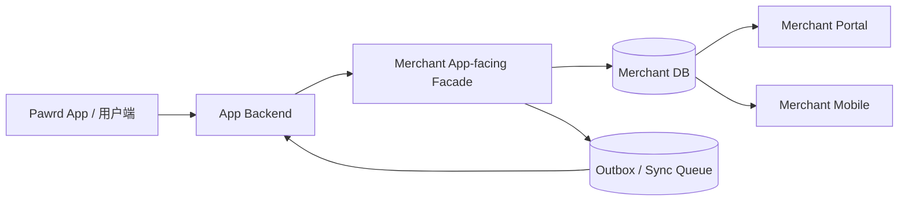

# Scheme 4 多仓联调实施计划

> 版本：v1.0  
> 日期：2026-04-06  
> 目标：直接按 **方案 4（同步下单 + 异步状态回传）** 落地，不经过方案 2 过渡。

---

## 0. 结论先行

是的，**当前这条正式生产链路需要至少 3 个项目联调**。

最小联动集合如下：

1. **用户侧后端 / App Backend**
2. **Merchant 系统（Merchant Backend + Merchant Portal）**
3. **用户侧客户端 / App Frontend**

如果把医生端 `Merchant Mobile` 也纳入第一期联调，则会变成 **3 个核心仓 + 1 个扩展客户端** 的协作模式。

---

## 1. 本次计划目标

本文件只做规划，不写代码。  
目标是把：

- 涉及的所有仓库
- 每个仓库承担的责任
- 需要预留的 GitHub 路径
- 联调执行顺序
- 跨仓依赖关系

一次性定义清楚，方便后续你补路径后直接进入执行。

---

## 1.1 联调进度看板（会话恢复入口）

> 以后每次新开窗口或新会话，优先先读这一节。  
> 这是三仓联调的**快速恢复上下文面板**。

### 当前状态

| 模块 | 状态 | 说明 |
|---|---|---|
| 总体方案选择 | ✅ 已确定 | 直接按 **方案 4** 落地，不经过方案 2 |
| 仓库识别 | ✅ 已完成 | R1 / R2 / R3 已确认，R4 暂不纳入第一期 |
| GitHub 路径整理 | ✅ 已完成 | 用户已填写，仓库改名差异已确认 |
| 正式架构文档 | ✅ 已完成 | 已产出 `pawrd_app_merchant_architecture_options.md` |
| 三仓总任务清单 | ⏳ 未开始 | 下一步建议输出 |
| R1 ↔ R2 API Contract | ⏳ 未开始 | 下一步建议输出 |
| 代码实施 | ⏳ 未开始 | 当前阶段只做 planning，不写代码 |

### 仓库状态速览

| 仓库 | 当前角色 | 当前状态 | 备注 |
|---|---|---|---|
| `R1 Pawrd_Backend` | 用户侧后端 / App Backend | 🟡 待实施 | 本地 remote 仍显示旧名 `Petwell_Backend`，已确认只是仓库改名 |
| `R2 Pawrd_merchant_latest` | Merchant Backend + Portal | 🟡 待实施 | 本地 remote 仍显示旧名/旧地址形式，已确认项目实体未变 |
| `R3 PetWell` | 用户侧 App Frontend | 🟡 待实施 | 当前 remote 与目标仓库一致 |
| `R4 Merchant Mobile` | 医生端移动处理 | ⚪ 暂缓 | 第一阶段先不纳入正式联调主线 |

### 当前阻塞项

| 类型 | 状态 | 说明 |
|---|---|---|
| 仓库路径 | ✅ 已解决 | 改名差异已确认，不再视为异常 |
| 联调任务拆分 | ⏳ 待完成 | 需要输出三仓总任务清单 |
| API 合同冻结 | ⏳ 待完成 | 需要输出 R1 ↔ R2 contract |
| 状态回传 payload | ⏳ 待完成 | 需要定义 outbox/sync_queue 契约 |

### 下次会话建议起手式

如果以后新开窗口，建议你直接对我说：

```text
继续三仓联调
先读 scheme4_multi_repo_rollout_plan.md 的联调进度看板
```

或者更短：

```text
继续联调
先恢复进度
```

### 本轮 planning 结论

1. **基准文件**：`docs/scheme4_multi_repo_rollout_plan.md`
2. **架构文档**：`docs/pawrd_app_merchant_architecture_options.md`
3. **当前阶段**：仍在 planning 阶段
4. **下一步**：输出三仓联调总任务清单

---

## 2. 需要涉及的仓库清单

## 2.1 核心必需仓库（正式方案 4）

| 编号 | 仓库名称 | 当前本地路径 | 角色 | 是否必需 | GitHub 仓库路径（待填写） |
|---|---|---|---|---|---|
| R1 | 用户侧后端 / App Backend | `apps/Petwell_Backend/` | 负责用户身份、宠物归属、支付/订单、调用 Merchant Facade、接收 Merchant 状态回传 | 是 | `待填写：https://github.com/vf0429/Pawrd_Backend.git` |
| R2 | Merchant Backend + Portal | `apps/petwell-merchant/` | 负责 Merchant App-facing Facade、Portal、预约主记录、outbox/sync queue | 是 | `待填写：目前没有分出来后端仓库 是不是要和前端区分开来比较好？https://github.com/vf0429/Pawrd_merchant_latest.git` |
| R3 | 用户侧客户端 / App Frontend（当前 PetWell iOS） | `apps/PetWell/` | 用户端发起预约、展示用户侧预约结果与状态 | 是 | `待填写：https://github.com/wwxxxxxx/PetWell.git` |

---

## 2.2 扩展仓库（视第一期范围决定）

| 编号 | 仓库名称 | 当前本地路径 | 角色 | 是否第一期必需 | GitHub 仓库路径（待填写） |
|---|---|---|---|---|---|
| R4 | Merchant Mobile（医生端 Swift） | `apps/swift code/merchant-mobile/` | 医生/前台移动处理端，读取 Merchant 主数据 | 可选 / 建议第二批 | `待填写：暂时不动这部分，因为逻辑简单可以直接参考merchant端` |

---

## 2.3 文档 / 规划归档位置

| 项目 | 建议位置 | 用途 |
|---|---|---|
| 总控方案文档 | `apps/petwell-merchant/docs/` | 作为 merchant 主导联调总控文档 |
| App Backend 联调说明 | `apps/Petwell_Backend/` 对应 docs 目录 | 记录 App Backend 改动与回调契约 |
| App Frontend 联调说明 | `apps/PetWell/` 对应 docs 目录 | 记录客户端预约链路与 UI 适配 |

---

## 3. 每个仓库的职责划分

## 左：仓库 / 右：职责

| 仓库 | 职责定义 |
|---|---|
| `R1 用户侧后端 / App Backend` | 负责用户认证、pet ownership、支付前置检查、向 Merchant Facade 发起 create booking、接收 Merchant 状态回传、更新用户侧 booking 记录 |
| `R2 Merchant Backend + Portal` | 负责 `/app/v1/*` facade、`clinic_appointments` 主表、`vaccination_booking_facades`、Portal 展示、Merchant staff 状态流转、outbox/sync_queue |
| `R3 用户侧客户端 / App Frontend` | 负责用户发起预约、展示 availability、展示 booking status、处理预约成功/失败反馈 |
| `R4 Merchant Mobile` | 负责医生/前台在移动端处理 Merchant 主系统数据；不拥有额外业务真相 |

---

## 4. 方案 4 对应的真实系统结构



### 关键说明

- **用户端不直连 Merchant internal API**
- **用户端 App（R3）不允许直接连接 Merchant Facade / Merchant Backend；正式链路必须是 `R3 -> R1 -> R2`**
- **App Backend 不直写 Merchant DB**
- **Merchant Backend 是预约主系统**
- **Portal / Merchant Mobile 都只读/处理 Merchant 主数据**
- **状态回传通过 outbox/sync queue**

---

## 5. 需要你填写的仓库信息

请你后续补充以下内容，我会据此继续拆分执行计划。

## 5.1 仓库路径填写区

### R1 用户侧后端 / App Backend
- GitHub 仓库路径：
  - `https://github.com/vf0429/Pawrd_Backend.git`
- 默认分支：
  - `main`
- 是否已有独立 docs 目录：
  - `待确认（本地看到 README / WORK_CONTEXT.md，建议后续补专门 docs 目录）`

### R2 Merchant Backend + Portal
- GitHub 仓库路径：
  - `https://github.com/vf0429/Pawrd_merchant_latest.git`
- 默认分支：
  - `phase-6（本地当前分支）`
- 是否前后端同仓：
  - `是（当前本地为同仓：backend + frontend + root package）`

### R3 用户侧客户端 / App Frontend
- GitHub 仓库路径：
  - `https://github.com/wwxxxxxx/PetWell.git`
- 默认分支：
  - `main`
- 当前客户端技术栈说明（如 iOS / SwiftUI）：
  - `iOS / SwiftUI / Xcode project（本地含 Pawrd.xcodeproj 与 PetWell.xcodeproj）`

### R4 Merchant Mobile（如第一期纳入）
- GitHub 仓库路径：
  - `暂不纳入第一期；当前未单独建 Git 仓库`
- 默认分支：
  - `N/A`
- 是否独立仓：
  - `当前不是独立仓（本地 NO_GIT）`

---

## 6. 多仓联调执行顺序（建议）

由于你希望**直接一步做到方案 4**，建议执行顺序如下：

### Phase A — 先锁合同
1. 锁定 App Backend ↔ Merchant Facade API 合同
2. 锁定状态回传 payload 合同
3. 锁定 ID 体系：
   - `external_booking_id`
   - `internal_appointment_id`
   - `tenant_id`
   - `clinic_integration_id`

### Phase B — 先打后端主链路
1. Merchant Backend
   - facade create booking
   - facade query/cancel
   - outbox/sync_queue
2. App Backend
   - create booking orchestration
   - callback / consumer
   - 用户侧状态更新

### Phase C — 再接前端
1. 用户端 App Frontend
   - 预约入口
   - 状态页
   - 错误处理
2. Merchant Portal
   - 确认可见
   - 状态流转
   - 回写 sync queue

### Phase D — 最后接 Merchant Mobile
1. 复用 Merchant Backend 数据
2. 只接医生/前台移动高频场景

---

## 7. 跨仓依赖关系

| 依赖方向 | 含义 | 谁先做 |
|---|---|---|
| R3 → R1 | 用户端调用用户侧后端 | R1 先 |
| R1 → R2 | App Backend 调 Merchant Facade | R2 合同先定，R1 再接 |
| R2 → R1 | Merchant 状态回传 App Backend | R1/R2 一起定义 contract |
| R4 → R2 | Merchant Mobile 读取 Merchant 主数据 | R2 先 |

### 关键结论

**R2（Merchant）与 R1（App Backend）是第一优先级双核心。**  
R3 和 R4 都依赖它们的合同稳定后再接。

---

## 8. 推荐的协作拆法

为了避免三个项目后期难协调，建议按“合同优先 + 分仓并行”来执行：

### Workstream 1 — Merchant 主链路
- 仓库：R2
- 负责内容：
  - facade
  - booking 主记录
  - status machine
  - outbox/sync_queue

### Workstream 2 — App Backend 编排与回传消费
- 仓库：R1
- 负责内容：
  - create booking orchestration
  - 状态回调 / 消费
  - App 侧 booking mirror

### Workstream 3 — 用户端预约体验
- 仓库：R3
- 负责内容：
  - availability UI
  - booking submit
  - booking status page

### Workstream 4 — Merchant Mobile
- 仓库：R4
- 负责内容：
  - 排班
  - 今日预约
  - 快捷处理

---

## 9. 第一批建议冻结的接口与字段

后续正式执行前，建议先冻结这些关键字段：

- `external_booking_id`
- `internal_appointment_id`
- `tenant_id`
- `clinic_integration_id`
- `scheduled_at`
- `booking_status`
- `sync_event_type`
- `request_id`
- `idempotency_key`
- `source_system`

---

## 10. 这份计划之后我会继续做什么

等你把 GitHub 路径补上后，我下一步建议继续输出：

1. **三仓联调总任务清单**
2. **每个仓库独立的实施 checklist**
3. **R1 ↔ R2 的 API Contract 正式版**
4. **方案 4 的 outbox / sync_queue payload 设计**

---

## 11. 当前建议

### 推荐决策
- 直接按 **方案 4** 规划
- 不再以方案 2 为过渡
- 但仍然遵守：
  - 先锁合同
  - 再改双后端
  - 最后接双客户端

### 一句话总结

> 当前正式生产落地将至少涉及 3 个核心仓库联调：用户侧后端、Merchant 系统、用户侧客户端；如果医生端同步纳入，则是 3+1 协作模式。应先冻结 App Backend ↔ Merchant Backend 的合同，再展开分仓并行实施。

---

## 12. 本地扫描结果与已确认说明

根据当前本地仓库扫描，发现以下事项需要确认：

### 12.1 R1 用户侧后端
- 文档填写的 GitHub 路径：`https://github.com/vf0429/Pawrd_Backend.git`
- 本地 git remote：`https://github.com/vf0429/Petwell_Backend.git`
- **已确认：这是仓库改名导致，项目实体未变。后续以 `Pawrd_Backend` 作为目标命名。**

### 12.2 R2 Merchant Backend + Portal
- 文档填写的 GitHub 路径：`https://github.com/vf0429/Pawrd_merchant_latest.git`
- 本地 git remote：`https://github.com/vf0429/pet-.git`
- **已确认：这也是仓库改名后的差异，项目实体未变。后续以 `Pawrd_merchant_latest` 作为目标命名。**

### 12.3 R3 用户侧客户端
- 文档填写路径与本地 remote 一致：
  - `https://github.com/wwxxxxxx/PetWell.git`
- **结论：当前没有明显问题。**

### 12.4 R4 Merchant Mobile
- 当前本地无独立 Git 仓库
- **结论：如果第一期不纳入，可以先保持现状；若后续纳入，需要决定是否独立建仓。**
